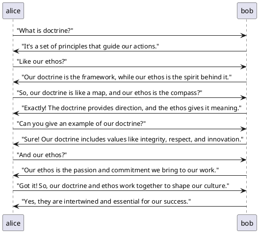
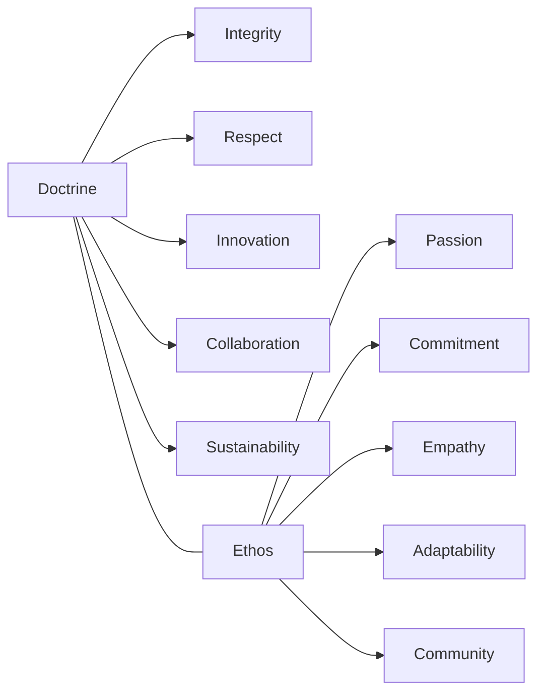

# Doctrine & Ethos

> "A tangled ball of trash..."

## Doctrine

It ain't just a set of rules; it's the backbone of RaccoonOps. Our doctrine is the foundation upon which we build our operations, guiding our decisions and actions. It reflects our core values and principles, ensuring that we remain aligned with our mission and vision. At the end of the day, our doctrine is about creating a culture of excellence, integrity, and respect, where every team member feels empowered to contribute and innovate - this is what makes RaccoonOps better than the rest, even if we are a bit of a mess sometimes.

## Key Principles

The doctrine of RaccoonOps is a set of guiding principles that shape our actions and decisions. It serves as a framework for our operations, ensuring that we maintain consistency and integrity in everything we do. Here are the key components of our doctrine:

- **Integrity**: We uphold the highest standards of honesty and transparency in all our interactions. We believe that trust is the foundation of our relationships, both internally and externally.
- **Respect**: We treat everyone with dignity and value diverse perspectives. You can be a raccoon, a human, or even a robot - we respect you all.
- **Innovation**: We embrace creativity and continuously seek to improve our processes and solutions. We encourage out-of-the-box thinking and are not afraid to take calculated risks.
- **Collaboration**: We work together as a team, leveraging each other's strengths to achieve common goals. We believe that collaboration leads to better outcomes and fosters a sense of community.
- **Sustainability**: We are committed to minimizing our environmental impact and promoting sustainable practices. We recognize our responsibility to the planet and strive to make decisions that benefit both our organization and the environment.

## Ethos

The ethos of RaccoonOps is the spirit and culture that drives our organization. It reflects our values, attitudes, and behaviors, creating a unique identity that sets us apart. Our ethos is characterized by:

- **Passion**: We are passionate about our work and dedicated to making a positive impact. We approach every task with enthusiasm and a desire to excel in whatever we do.
- **Commitment**: We are committed to excellence and strive to exceed expectations in everything we do. We take ownership of our responsibilities and hold ourselves accountable for our actions.
- **Empathy**: We understand and care for the needs of our team members, clients, and community. We listen actively and seek to understand different perspectives, fostering a culture of inclusivity and support.
- **Adaptability**: We are flexible and open to change, ready to embrace new challenges and opportunities. We recognize that the world is constantly evolving, and we must be willing to adapt to stay relevant and effective.
- **Community**: We foster a sense of belonging and support, building strong relationships within our team and with our clients. We believe that a strong community enhances our ability to achieve our goals and create a positive impact. We are all in this together, like a family of raccoons working towards a common goal.

## Conclusion

The doctrine and ethos of RaccoonOps are integral to our success. They guide our actions, shape our culture, and define who we are as an organization. By adhering to these principles, we ensure that we remain true to our mission and values, creating a positive and impactful environment for everyone involved.
By understanding and embodying our doctrine and ethos, we can navigate the complexities of our work with clarity and purpose. Together, they form the foundation of RaccoonOps, driving us towards a future of innovation, collaboration, and excellence.

## Visual Representation

## Summary

At the core of RaccoonOps is a commitment to our doctrine and ethos. These guiding principles shape our culture, influence our decision-making, and drive our actions. By adhering to our doctrine, we create an environment that fosters innovation, collaboration, and respect for all individuals. Our ethos reinforces these values, emphasizing the importance of passion, empathy, and community in everything we do. Together, our doctrine and ethos form the foundation of RaccoonOps, enabling us to navigate challenges and seize opportunities with confidence and purpose.

## Call to Action

As we continue to grow and evolve, let us remain steadfast in our commitment to our doctrine and ethos. Embrace the principles that define RaccoonOps, and let them guide your actions and decisions. Together, we can create a culture of excellence that empowers every team member to contribute their best and make a positive impact in the world.
Remember, our doctrine and ethos are not just words on a page; they are the essence of who we are as an organization. Let us embody these principles in everything we do, ensuring that RaccoonOps remains a place where innovation thrives, collaboration flourishes, and respect is paramount. Together, we can achieve great things and make a lasting difference in the world.
So, let's roll up our sleeves, embrace our doctrine and ethos, and continue to build a better future for RaccoonOps and beyond. Together, we can make a difference, one raccoon at a time!
