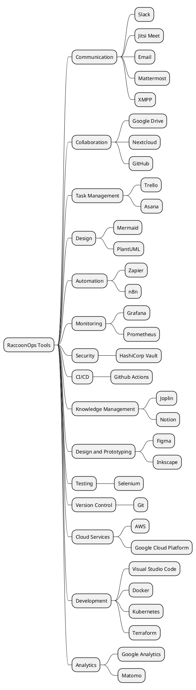

# Tools of the Trade

> "Simple and composable..."

RaccoonOps is built on the principle of using simple and composable tools that enhance our productivity and collaboration. We believe in leveraging both open-source and commercial tools that align with our values and operational needs. Our toolkit is designed to be flexible, allowing us to adapt to changing requirements while maintaining efficiency and effectiveness in our workflows.

Why not 100% open-source? While we strive to use open-source tools whenever possible, we also recognize the value that commercial tools can bring in terms of support, features, and integration. Our goal is to find the right balance that meets our needs and supports our mission. Your balance may vary, and we encourage you to choose tools that work best for your team and projects. If you find a tool that fits your needs, go for it! The key is to ensure that the tools you use are simple, composable, and enhance your team's productivity.

## Tools

In RaccoonOps, we believe in using the right tools for the job. Our toolkit is designed to be simple, composable, and effective, enabling our team to work efficiently and collaboratively. For each aspect of our operations, we have selected tools that align with our values and enhance our productivity. Here’s a breakdown of the key tools we recommand for different purposes:

- **Communication**: These tools help us stay connected and share information quickly.
  - **Slack**: (Commercial) Slack is our primary communication platform, allowing real-time messaging, file sharing, and integration with other tools.
  - **Jitsi Meet**: (Open Source) Jitsi Meet is our go-to for video conferencing, providing secure and reliable video calls without the need for third-party services.
  - **Email**: (Open Source) We use email for formal communication and documentation, ensuring that important information is archived and accessible.
  - **Mattermost**: (Open Source) Mattermost is an alternative to Slack, providing a self-hosted solution for team communication and collaboration.
  - **XMPP**: (Open Source) XMPP is a protocol for real-time communication, allowing us to set up our own messaging servers and maintain control over our communication.
- **Collaboration**: These tools facilitate teamwork and document sharing.
  - **Google Drive**: (Commercial) Google Drive is our primary platform for file storage and collaboration, allowing team members to create, share, and edit documents in real-time.
  - **Nextcloud**: (Open Source) Nextcloud is our self-hosted alternative to Google Drive, providing file storage, sharing, and collaboration features while maintaining control over our data.
  - **GitHub**: (Commercial) GitHub is our version control system, enabling us to collaborate on code, track changes, and manage projects effectively.
- **Task Management**: These tools help us organize our work and track progress.
  - **Trello**: (Commercial) Trello is our task management tool, allowing us to create boards, lists, and cards to organize tasks and projects visually.
  - **Asana**: (Commercial) Asana is another task management tool we use for more complex projects, providing features like timelines, dependencies, and team collaboration.
- **Design**: These tools assist in creating visual content and prototypes.
  - **Mermaid**: (Open Source) Mermaid is our preferred tool for creating diagrams and flowcharts, allowing us to visualize processes and systems in a simple and readable format.
  - **PlantUML**: (Open Source) PlantUML is used for generating UML diagrams from plain text descriptions, helping us document system architecture and design.
- **Automation**: These tools help us automate repetitive tasks and workflows.
  - **Zapier**: (Commercial) Zapier allows us to connect different applications and automate workflows, reducing manual effort and improving efficiency.
  - **n8n**: (Commercial) n8n is an open-source alternative to Zapier, providing similar automation capabilities with more flexibility and control over our workflows.
- **Monitoring**: These tools help us track system performance and health.
  - **Grafana**: (Open Source) Grafana is our monitoring and visualization tool, allowing us to create dashboards and alerts for system performance metrics.
  - **Prometheus**: (Open Source) Prometheus is our time-series database for collecting and querying metrics, providing insights into system health and performance.
- **Security**: These tools help us ensure the security of our systems and data.
  - **HashiCorp Vault**: (Open Source) Vault is our secret management tool, allowing us to securely store and manage sensitive information like API keys and passwords.
- **CI/CD**: These tools help us automate our software development processes.
  - **Github Actions**: (Commercial) Github Actions is our continuous integration and deployment tool, enabling us to automate testing, building, and deploying our applications.
- **Knowledge Management**: These tools help us document and share knowledge within the team.
  - **Joplin**: (Open Source) Joplin is our note-taking and knowledge management tool, allowing us to create, organize, and share documentation and notes across the team.
  - **Notion**: (Commercial) Notion is used for creating and managing documentation, wikis, and project notes, providing a flexible workspace for our team to collaborate and share knowledge.
- **Design and Prototyping**: These tools assist in creating visual designs and prototypes.
  - **Figma**: (Commercial) Figma is our primary design tool, allowing us to create and collaborate on UI/UX designs in real-time.
  - **Inkscape**: (Open Source) Inkscape is used for vector graphics editing, enabling us to create and edit scalable graphics for various purposes.
- **Testing**: These tools help us ensure the quality of our software.
  - **Selenium**: (Open Source) Selenium is our automated testing framework, allowing us to write and execute tests for web applications to ensure functionality and performance.
- **Version Control**: These tools help us manage changes to our codebase.
  - **Git**: (Open Source) Git is our version control system, enabling us to track changes, collaborate on code, and manage branches effectively.
- **Cloud Services**: These tools provide cloud infrastructure and services.
  - **AWS**: (Commercial) Amazon Web Services is our primary cloud provider, offering a wide range of services for hosting, storage, and computing.
  - **Google Cloud Platform**: (Commercial) Google Cloud Platform is another cloud provider we use for specific services and applications, providing flexibility and scalability.
- **Development**: These tools assist in software development and coding practices.
  - **Visual Studio Code**: (Open Source) VS Code is our primary code editor, providing a powerful and customizable environment for writing and debugging code.
  - **Docker**: (Open Source) Docker is used for containerization, allowing us to package applications and their dependencies into portable containers for consistent deployment across environments.
  - **Kubernetes**: (Open Source) Kubernetes is our container orchestration platform, enabling us to manage and scale containerized applications efficiently.
  - **Terraform**: (Open Source) Terraform is our infrastructure as code tool, allowing us to define and manage our infrastructure using declarative configuration files.
- **Analytics**: These tools help us analyze data and gain insights.
  - **Google Analytics**: (Commercial) Google Analytics is used for tracking website traffic and user behavior, providing valuable insights into our online presence.
  - **Matomo**: (Open Source) Matomo is an open-source alternative to Google Analytics, allowing us to track and analyze website traffic while maintaining control over our data.
- **Project Management**: These tools help us plan and execute projects effectively.

By using tools effectively, we can enhance our productivity, collaboration, and overall success as a team. We are always on the lookout for new tools and technologies that can help us improve our processes and achieve our goals.

## Summary

| Tool Category | Tool Name | Type | Description | Open Source | Commercial |
|---------------|-----------|------|-------------|-------------|------------|
| Communication | Slack | Commercial | Real-time messaging and collaboration platform | No | Yes |
| Communication | Jitsi Meet | Open Source | Video conferencing tool for secure calls | Yes | No |
| Communication | Email | Open Source | Formal communication and documentation | Yes | No |
| Communication | Mattermost | Open Source | Self-hosted team communication platform | Yes | No |
| Communication | XMPP | Open Source | Real-time messaging protocol | Yes | No |
| Collaboration | Google Drive | Commercial | File storage and collaboration platform | No | Yes |
| Collaboration | Nextcloud | Open Source | Self-hosted file storage and collaboration | Yes | No |
| Collaboration | GitHub | Commercial | Version control and project management | No | Yes |
| Task Management | Trello | Commercial | Visual task management tool | No | Yes |
| Task Management | Asana | Commercial | Task management with timelines and dependencies | No | Yes |
| Design | Mermaid | Open Source | Diagram and flow chart generation | Yes | No |
| Design | PlantUML | Open Source | UML diagram generation | Yes | No |
| Automation | Zapier | Commercial | Automate workflows and connect applications | No | Yes |
| Automation | n8n | Commercial | Continuous integration and deployment | No | Yes |
| Monitoring | Grafana | Open Source | Monitoring and visualization tool | Yes | No |
| Monitoring | Prometheus | Open Source | Time-series database for metrics | Yes | No |
| Security | HashiCorp Vault | Open Source | Secret management tool | Yes | No |
| CI/CD | Github Actions | Commercial | Continuous integration and deployment | No | Yes |
| Knowledge Management | Joplin | Open Source | Note-taking and knowledge management | Yes | No |
| Knowledge Management | Notion | Commercial | Documentation, wikis, and project notes | No | Yes |
| Design and Prototyping | Figma | Commercial | UI/UX design and prototyping | No | Yes |
| Design and Prototyping | Inkscape | Open Source | Vector graphics editing | Yes | No |
| Testing | Selenium | Open Source | Automated testing framework | Yes | No |
| Version Control | Git | Open Source | Version control system | Yes | No |
| Cloud Services | AWS | Commercial | Cloud infrastructure and services | No | Yes |
| Cloud Services | Google Cloud Platform | Commercial | Cloud infrastructure and services | No | Yes |
| Development | Visual Studio Code | Open Source | Code editor and debugger | Yes | No |
| Development | Docker | Open Source | Containerization platform | Yes | No |
| Development | Kubernetes | Open Source | Container orchestration platform | Yes | No |
| Development | Terraform | Open Source | Infrastructure as code tool | Yes | No |
| Analytics | Google Analytics | Commercial | Website tracking and analysis | No | Yes |
| Analytics | Matomo | Open Source | Website tracking and analysis | Yes | No |

## Conclusion
RaccoonOps is committed to using simple and composable tools that enhance our productivity and collaboration. Our toolkit is designed to be flexible, allowing us to adapt to changing requirements while maintaining efficiency and effectiveness in our workflows. By leveraging both open-source and commercial tools, we ensure that we have the right resources to support our mission and achieve our goals. Remember, the key is to choose tools that work best for your team and projects, whether they are open-source or commercial.
We encourage you to explore the tools mentioned above and find the ones that fit your needs. If you discover a tool that enhances your workflow, don't hesitate to incorporate it into your toolkit. The goal is to create a productive and collaborative environment where everyone can thrive.
By embracing a diverse set of tools, we can empower our team to work more effectively, innovate continuously, and deliver exceptional results. Let's continue to build a toolkit that supports our mission and drives our success as a team.
## Visual Representation

/*mindmap*/

